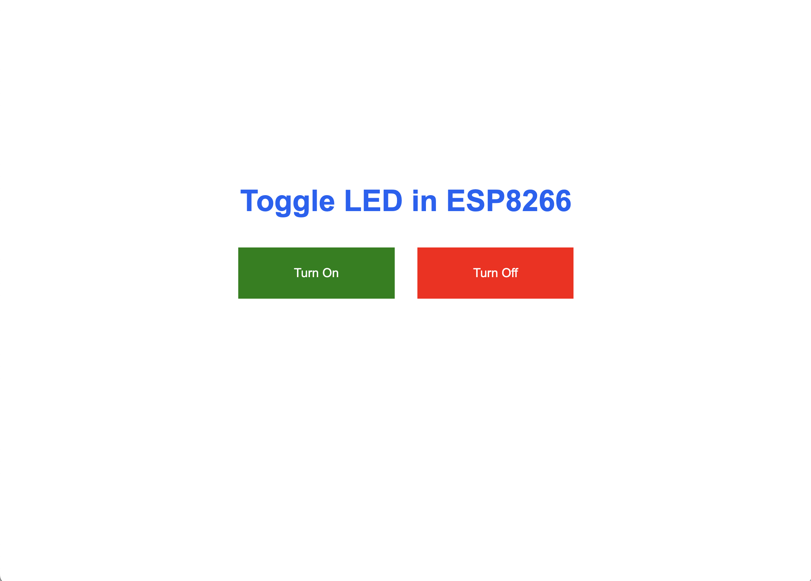

# NodeMCU Home Automation with Firebase

This project demonstrates a simple home automation system using a NodeMCU (ESP8266) microcontroller. It provides a web-based interface to **remotely toggle an LED** and **store the LED state persistently** using Firebase Realtime Database.

---

## 📌 Features

- 🔘 Web interface to control LED (ON/OFF)
- 🔥 Real-time state sync using Firebase
- 📶 Auto-switch between Access Point mode and home Wi-Fi
- ♻️ Factory reset via physical button (D8 pin)
- 🔒 Web form to update home Wi-Fi credentials dynamically

---

## 🛠️ Hardware Requirements

- NodeMCU (ESP8266)
- LED + Resistor
- Breadboard and Jumper wires
- Micro USB Cable
- Internet access (for Firebase)

---

## 🧰 Software Requirements

- [Arduino IDE](https://www.arduino.cc/en/software)
- NodeMCU ESP8266 Board Package
- Libraries:
  - `FirebaseESP8266.h`
  - `ESP8266WiFi.h`
  - `ESP8266WebServer.h`

---

## 🔧 Circuit Diagram

| Component | NodeMCU Pin |
|----------|--------------|
| LED (+)  | D4           |
| Button   | D8           |

> Make sure the button pulls D8 LOW when pressed (INPUT_PULLUP logic)

---

## 🌐 Web Interface

Once powered up:

- If not connected to Wi-Fi, the NodeMCU starts in **Access Point mode**:
  - SSID: `NodeMCU_AP`
  - Password: `Password123`
- Visit the IP shown in Serial Monitor (usually `192.168.4.1`)
- Submit home Wi-Fi credentials via the form
- Once connected, it switches to **Wi-Fi Client mode**

---

## 🔄 Firebase Integration

- Firebase Realtime Database URL:  
  `https://fir-8e392-default-rtdb.asia-southeast1.firebasedatabase.app/`

- Data Path for LED:  
  `/FirebaseIOT/led`

- Acceptable values:
  - `"1"` → LED ON
  - `"0"` → LED OFF

The LED state is fetched every 5 seconds and updated in real-time.

---

## 🧪 How It Works

1. User accesses web interface and toggles the LED via Firebase.
2. NodeMCU periodically fetches the state from Firebase.
3. LED toggles based on stored value.
4. Press and hold the button on D8 for 5 seconds to trigger a factory reset (resets Wi-Fi to AP mode).

---
